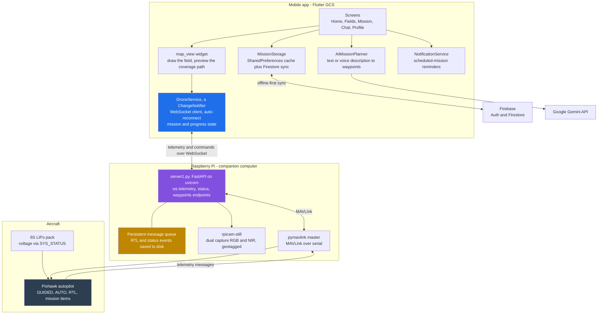
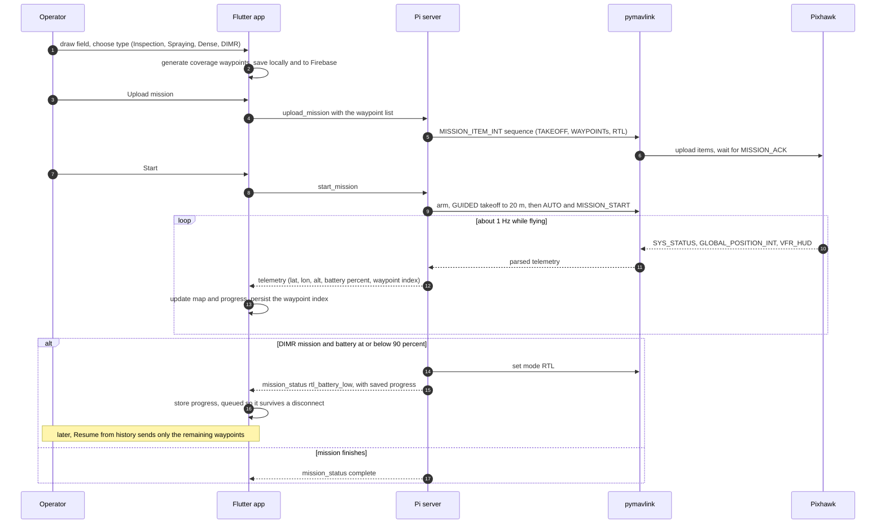

# Agron GCS - Agricultural Drone Ground Control Station

A cross-platform Ground Control Station (GCS) application for agricultural drones, built with Flutter. This application enables users to plan and execute drone missions for agricultural inspection and spraying tasks, with real-time telemetry from Pixhawk autopilots.

## Features

- **Real-time Drone Telemetry**: Live position, altitude, speed, heading, and battery monitoring from Pixhawk via MAVLink
- **Advanced Battery Monitoring**: 
  - Voltage-based percentage calculation using LiPo discharge curve
  - Automatic RTL trigger at configurable battery threshold (90%)
  - Support for 6S LiPo batteries (19.8V - 25.2V range)
- **Mission Planning**: 
  - Multiple mission types: Inspection, Spraying, Dense Inspection, DIMR
  - Draw field boundaries on interactive maps with satellite/street view toggle
  - Automatic dense coverage path generation for inspection missions
  - Boustrophedon (lawnmower) pattern with configurable overlap
  - Automatic first waypoint at current drone location
  - Save missions locally with offline-first architecture
- **Mission Resumption (DIMR)**:
  - Automatic mission pause on low battery with RTL
  - Persistent progress tracking (waypoint-level granularity)
  - Resume incomplete missions from last completed waypoint
  - Offline mission state storage with Firebase sync
  - Resume button for incomplete missions in history
- **Drone Control**:
  - Start/Stop/Resume mission execution with Pixhawk integration
  - Emergency return functionality (RTL)
  - Real-time mission progress tracking (percentage and waypoint count)
  - Automatic reconnection with persistent message queue
- **Visual Interface**:
  - Custom quadcopter marker on map that rotates with drone heading
  - Live compass widget showing drone orientation
  - Dense path preview with direction arrows
  - Mission progress indicators
  - Camera capture controls (start/stop recording)
- **Map Features**:
  - Offline tile caching for reduced data usage
  - Convex hull calculation for field areas
  - Mission waypoint visualization
  - Dense inspection path preview
- **Communication**:
  - WebSocket connection to Raspberry Pi server
  - Real-time telemetry streaming
  - Mission upload to flight controller
  - Persistent message queue for critical events
  - Automatic delivery of missed messages on reconnection

## Architecture

Agron is three cooperating parts: a Flutter app the operator flies from, a
FastAPI server on a Raspberry Pi that owns the MAVLink link, and the Pixhawk
autopilot on the aircraft. The app is offline-first: missions are planned,
saved, and resumed locally, and synced to Firebase when a connection is
available.





## System Requirements

- **Flutter SDK** (>=3.0.0)
- **Dart SDK** (>=3.0.0)
- **Android SDK** (API level 23+)
- **Raspberry Pi** with Pixhawk autopilot
- **Python 3.8+** (for server)
- **pymavlink** (for MAVLink communication)

## Installation

### Mobile App (Flutter)

1. Clone the repository:
   ```bash
   git clone https://github.com/Husnaiin/Agron.git
   cd agron_mobile\ app
   ```

2. Install dependencies:
   ```bash
   flutter pub get
   ```

3. Run the application:
   ```bash
   flutter run
   ```

### Server Setup (Raspberry Pi)

1. Install Python dependencies:
   ```bash
   pip install fastapi uvicorn websockets pymavlink
   ```

2. Connect Pixhawk to Raspberry Pi via USB/serial

3. Run the server:
   ```bash
   uvicorn server1:app --host 0.0.0.0 --port 5001 --reload
   ```

4. Connect mobile app to Raspberry Pi IP address

## Project Structure

```
agron_mobile app/
├── lib/
│   ├── main.dart                 # App entry point
│   ├── models/
│   │   ├── mission.dart         # Mission data models
│   │   └── telemetry.dart       # Telemetry data models
│   ├── screens/
│   │   ├── auth/
│   │   │   └── login_screen.dart
│   │   ├── home/
│   │   │   └── home_screen.dart
│   │   ├── mission_screen.dart
│   │   └── chat_screen.dart
│   ├── widgets/
│   │   ├── map_view.dart        # Interactive map with drone tracking
│   │   ├── telemetry_panel.dart # Real-time telemetry display
│   │   ├── mission_controls.dart
│   │   ├── audio_recorder.dart
│   │   └── emergency_puzzle.dart
│   ├── services/
│   │   ├── drone_service.dart   # WebSocket communication
│   │   ├── auth_service.dart
│   │   └── mission_storage.dart
│   └── providers/
│       └── auth_provider.dart
├── server1.py                   # FastAPI server with MAVLink integration
├── server.py                    # Legacy Flask server
└── requirements.txt             # Python dependencies
```

## Key Components

### Mobile App Features

- **Map View**: Interactive map with OpenStreetMap tiles, satellite view toggle, offline caching
- **Drone Tracking**: Custom quadcopter marker that rotates with heading from telemetry
- **Compass**: Live compass widget showing drone orientation
- **Mission Planning**: 
  - Draw field boundaries with automatic dense path generation
  - Real-time preview of coverage pattern
  - Four mission types with automatic waypoint optimization
  - Configurable altitude and speed parameters
- **Mission History**: 
  - View all missions with progress tracking
  - Resume button for incomplete missions
  - Schedule missions with reminder notifications
  - Local storage with cloud backup
- **Camera Controls**: Start/stop camera capture with visual feedback
- **Telemetry Panel**: Real-time display of drone position, altitude, speed, heading, battery voltage and percentage

### Server Features

- **MAVLink Integration**: Direct communication with Pixhawk autopilot via serial connection
- **Mission Upload**: Upload waypoints to flight controller with proper MAVLink MISSION_ITEM_INT protocol
- **Real-time Telemetry**: Stream live drone data via WebSocket at 1Hz
- **Battery Monitoring**: Voltage-based percentage calculation with automatic RTL at threshold
- **Progress Tracking**: Waypoint-level mission progress with real-time updates
- **Camera Capture**: Dual camera support (RGB + NIR) with session-based naming and geotag metadata
- **Persistent Queue**: Critical event messages saved to disk for guaranteed delivery
- **Mission Control**: Start/stop/pause missions with Pixhawk AUTO mode integration

## Usage

1. **Connect to Drone**:
   - Enter Raspberry Pi IP address in connection dialog
   - App connects via WebSocket to server running on Pi
   - Connection automatically reconnects using saved IP address

2. **Plan Mission**:
   - Select mission type (Inspection, Spraying, Dense Inspection, or DIMR)
   - Draw field boundaries by tapping on map
   - For dense missions: preview shows generated coverage pattern
   - First waypoint automatically set to current drone location
   - Save mission (stored locally with offline support)

3. **Execute Mission**:
   - Upload mission to Pixhawk autopilot
   - Start mission from mission controls
   - Monitor real-time telemetry, progress percentage, and waypoint completion
   - For DIMR missions: automatic RTL at 90% battery threshold

4. **Resume Mission** (DIMR only):
   - If battery RTL triggered, mission progress saved automatically
   - Navigate to Mission History screen
   - Incomplete missions show progress percentage and Resume button
   - Click Resume to continue from last completed waypoint
   - App sends remaining waypoints as new mission to Pixhawk

5. **Camera Operations**:
   - Start/stop camera capture during flight
   - Images saved with session ID, timestamp, altitude, and GPS coordinates
   - Files organized in date-based folders: `/home/agron/DD-MMM-data-agron/`

## Mission Types

- **Inspection**: Perimeter coverage following convex hull of selected area
- **Spraying**: Point-to-point coverage along user-defined waypoints
- **Dense Inspection**: Full area coverage with boustrophedon pattern and 70% overlap
- **DIMR** (Dense Inspection with Mission Resumption): Dense inspection with automatic battery monitoring and mission resumption capability

## Technical Details

### Communication Architecture
- **WebSocket**: Real-time telemetry and command streaming
- **MAVLink**: Direct Pixhawk autopilot control and telemetry
- **Persistent Queue**: Critical messages saved to disk and delivered on reconnection

### Battery Management
- **Voltage Monitoring**: Real-time battery voltage from Pixhawk SYS_STATUS messages
- **LiPo Discharge Curve**: Accurate percentage calculation for 6S batteries
- **Threshold Points**: 25.2V (100%), 24.3V (83%), 23.4V (67%), 22.5V (50%), 21.6V (33%), 20.7V (17%), 19.8V (0%)
- **Automatic RTL**: Triggered at 90% threshold for DIMR missions

### Mission Storage
- **Offline-First**: Local cache using SharedPreferences (works without internet)
- **Firebase Sync**: Automatic background synchronization when online
- **Progress Tracking**: Waypoint-level completion tracking with percentage
- **Mission Resumption**: Sliced waypoint arrays for seamless continuation

### Path Generation
- **Dense Coverage**: Boustrophedon (lawnmower) pattern with horizontal scanlines
- **Configurable Overlap**: 70% forward and side overlap for image stitching
- **Optimized Spacing**: Calculated from camera FOV and altitude (16.8m at 20m altitude)
- **Deduplication**: Removes consecutive waypoints closer than 0.5m

### Map System
- **Tiles**: OpenStreetMap with offline caching to device storage
- **Mission Format**: MAVLink MISSION_ITEM_INT with TAKEOFF, WAYPOINT, RTL sequence
- **Camera**: rpicam-still for dual camera capture (RGB + NIR)

## Data Persistence and Reliability

### Offline-First Architecture
- **Local Storage**: All missions and progress stored in SharedPreferences
- **No Internet Required**: Full functionality at remote agricultural sites
- **Firebase Sync**: Automatic background synchronization when connection available
- **Conflict Resolution**: Local progress takes precedence over cloud data

### Persistent Message Queue
- **Critical Events**: RTL triggers and mission status changes saved to disk
- **Guaranteed Delivery**: Messages queued if connection drops, delivered on reconnection
- **Thread-Safe**: Locked file operations prevent race conditions
- **Auto-Cleanup**: Queue cleared after successful delivery or new mission start

### Mission Progress Tracking
- **Real-Time Updates**: Waypoint completion tracked during flight
- **Percentage Calculation**: Progress computed from current waypoint / total waypoints
- **Persistent State**: Progress saved immediately when RTL triggered
- **Resume Logic**: App slices waypoint array to send only remaining points

## Contributing

1. Fork the repository
2. Create your feature branch (`git checkout -b feature/amazing-feature`)
3. Commit your changes (`git commit -m 'Add some amazing feature'`)
4. Push to the branch (`git push origin feature/amazing-feature`)
5. Open a Pull Request

## License

This project is licensed under the MIT License - see the [LICENSE](LICENSE) file for details.

## Acknowledgments

- Flutter team for the amazing framework
- ArduPilot community for MAVLink protocol
- OpenStreetMap for mapping data
- Raspberry Pi Foundation for hardware platform